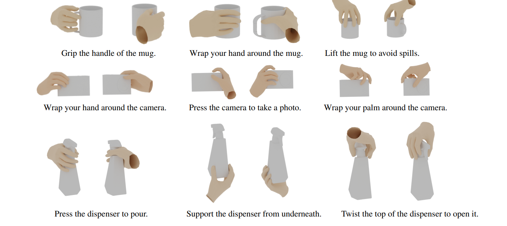








# Welcome! 
I am currently a master's student at [The University of ShangHaiTech](https://www.shanghaitech.edu.cn/). Fortunately to be supervised  by [Prof. Xuming He](https://faculty.sist.shanghaitech.edu.cn/faculty/hexm/index.html) in the Plus Lab, part of The Visual & Data Intelligence (VDI) Center.

My research interests include Deep Learning, Generative Models, and Embodied AI.

<!--插入图片语法为：-->

# 🔥 News
- *2026.2*: &nbsp;one Paper accepted by CVPR 
- *2024.11*: &nbsp;one Paper accepted by the International Conference on 3D Vision (3DV-2025)
- *2024.01*: &nbsp;one paper accepted by International Joint Conference on Artificial Intelligence (IJCAI-2024)

# 📝 Publications 

[Pack and Force Your Memory: Long-form and Consistent Video Generation](https://arxiv.org/abs/2510.01784)

**xiaofei wu**, Guozhen Zhang, Zhiyong Xu, Yuan Zhou, Qinglin Lu, Xuming He

[**Project**](https://wuxiaofei01.github.io/PFVG/)

CVPR 2026

[AffordGrasp: Cross-Modal Diffusion forAffordance-Aware Grasp Synthesis]()

**xiaofei wu**, Yi Zhang, Yumeng Liu, Yuexin Ma, Yujiao Shi, Xuming He

3DV 2025

[FastGrasp: Efficient Grasp Synthesis with Diffusion](https://arxiv.org/abs/2411.14786)

**xiaofei wu**, Tao Liu, caoji li, Yuexin Ma, Yujiao Shi, Xuming He

[**Project**](https://github.com/wuxiaofei01/FastGrasp)

IJCAI 2024

[Realdex: Towards human-like grasping for robotic dexterous hand](https://arxiv.org/abs/2402.13853)

Yumeng Liu\*, Yaxun Yang\*, Youzhuo Wang\*, Xiaofei Wu , Jiamin Wang , Yichen Yao , Sören Schwertfeger, Sibei Yang, Wenping Wang, Jingyi Yu, Xuming He, Yuexin Ma,

[**Project**](https://4dvlab.github.io/RealDex_page/)

# 🎖 Honors and Awards
- *2024.12* Outstanding students of ShanghaiTech University (Top 10%)
- *2022.08* Robocom Robot Developer Competition, Silver Medal
- *2021-06* Bronze Medal in National College Student Group Programming Competition
- *2020.10* Gold Award in Liaoning Provincial Programming Competition (Top 5%)
- *2020.9* Northeastern University First Class Scholarship (top 10%)
- *2020.3* Outstanding students of Northeastern University (Top 10%)

# 📖 Educations
- *2023.09 - 2026.07*, Master of The Visual & Data Intelligence (VDI) Center, ShangHaiTech University, ShangHai, China
  - Supervised by [Prof. Xuming He](https://faculty.sist.shanghaitech.edu.cn/faculty/hexm/index.html)
- *2019.09 - 2023.07*, Bachelor of Computer Science and Technology Major, Northeastern University, shenyang, China

# 💻 Internships

  <!-- 腾讯混元卡片 -->
  

      

          

              
Tencent

              
          

      

      

          <a href="https://hunyuan.tencent.com/" style="text-decoration: none; color: #007bff; font-size: 18px; font-weight: 600; display: inline-block; margin-bottom: 8px;">Tencent - HunYuan</a>
          
<strong>Department · HY · Video Generation</strong>

          <ul style="margin: 0; padding-left: 20px; color: #555; font-size: 14px; list-style: disc;">
              <li style="margin-bottom: 4px;">Advised by Mr. Yuan Zhou</li>
              <li>2025.4 - 2025.10</li>
          </ul>
      

  

  <!-- AGI-Bot卡片 -->
  

      

          

              
Agi-Bot

              
          

      

      

          <a href="https://www.zhiyuan-robot.com/" style="text-decoration: none; color: #007bff; font-size: 18px; font-weight: 600; display: inline-block; margin-bottom: 8px;">AGI-Bot</a>
          
<strong>Department · World Model/ Video Generation</strong>

          <ul style="margin: 0; padding-left: 20px; color: #555; font-size: 14px; list-style: disc;">
              <li style="margin-bottom: 4px;">Advised by Mr. Liliang Chen</li>
              <li>2024.12 - 2025.3</li>
          </ul>
      

  

  <!-- 腾讯Robotics X卡片 -->
  

      

          

              
Tencent

              
          

      

      

          <a href="https://roboticsx.tencent.com/" style="text-decoration: none; color: #007bff; font-size: 18px; font-weight: 600; display: inline-block; margin-bottom: 8px;">Tencent - Robotics X</a>
          
<strong>Department · Embodied AI · Perception and Action Collaboration Group</strong>

          <ul style="margin: 0; padding-left: 20px; color: #555; font-size: 14px; list-style: disc;">
              <li style="margin-bottom: 4px;">Advised by Mr. Yu Zheng</li>
              <li>2024.09 - 2024.12</li>
          </ul>
      

  

