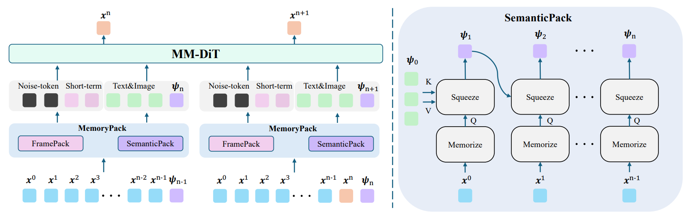
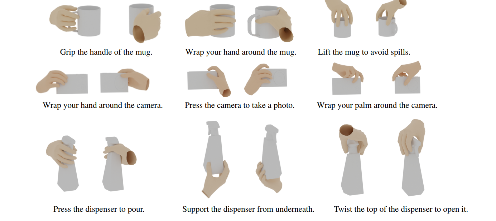
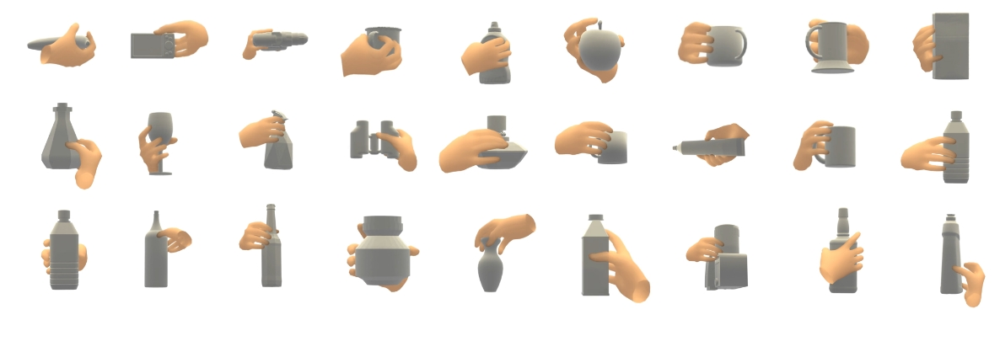
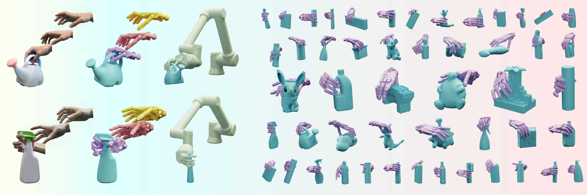








# Welcome!
I currently work  at [Meshy AI](https://www.meshy.ai/), where my research centers on state-of-the-art 3D generative AI technologies. Prior to this role, I completed my Master’s degree at at [ShanghaiTech University](https://www.shanghaitech.edu.cn/), supervised by [Prof. Xuming He](https://faculty.sist.shanghaitech.edu.cn/faculty/hexm/index.html) in the Plus Lab at the Visual & Data Intelligence (VDI) Center.

My research interests include **Deep Learning**, **Generative Models**, and **Embodied AI**.

<!--插入图片语法为：-->

# 🔥 News
- *2026.07* &nbsp;I join [Meshy AI](https://www.meshy.ai/).
- *2026.02* &nbsp;One paper accepted by **CVPR 2026**
- *2024.11* &nbsp;One paper accepted by the International Conference on 3D Vision (**3DV 2025**)
- *2024.01* &nbsp;One paper accepted by the International Joint Conference on Artificial Intelligence (**IJCAI 2024**)

# 💻 Internships
- *2026.01 - 2026.06*, [**ByteDance &middot; TikTok**](https://www.tiktok.com/) &mdash; Generative Recommendation &middot; Advised by Mr. Kai Feng
- *2025.04 - 2025.10*, [**Tencent &middot; Hunyuan**](https://hunyuan.tencent.com/) &mdash; Video Generation &middot; Advised by Mr. Yuan Zhou
- *2024.12 - 2025.03*, [**AGI-Bot**](https://www.zhiyuan-robot.com/) &mdash; World Model / Video Generation &middot; Advised by Mr. Liliang Chen
- *2024.09 - 2024.12*, [**Tencent &middot; Robotics X**](https://roboticsx.tencent.com/) &mdash; Embodied AI, Perception and Action Collaboration Group &middot; Advised by Mr. Yu Zheng
# 📝 Publications 

Preprint

[Pack and Force Your Memory: Long-form and Consistent Video Generation](https://arxiv.org/abs/2510.01784)

**Xiaofei Wu**, Guozhen Zhang, Zhiyong Xu, Yuan Zhou, Qinglin Lu, Xuming He

[**Project**](https://wuxiaofei01.github.io/PFVG/)

CVPR 2026

[AffordGrasp: Cross-Modal Diffusion for Affordance-Aware Grasp Synthesis](https://arxiv.org/abs/2603.08021)

**Xiaofei Wu**, Yi Zhang, Yumeng Liu, Yuexin Ma, Yujiao Shi, Xuming He

[**Project**](https://wuxiaofei01.github.io/AffordGrasp_page)

3DV 2025

[FastGrasp: Efficient Grasp Synthesis with Diffusion](https://arxiv.org/abs/2411.14786)

**Xiaofei Wu**, Tao Liu, Caoji Li, Yuexin Ma, Yujiao Shi, Xuming He

[**Project**](https://github.com/wuxiaofei01/FastGrasp)

IJCAI 2024

[RealDex: Towards Human-like Grasping for Robotic Dexterous Hand](https://arxiv.org/abs/2402.13853)

Yumeng Liu\*, Yaxun Yang\*, Youzhuo Wang\*, **Xiaofei Wu**, Jiamin Wang, Yichen Yao, Sören Schwertfeger, Sibei Yang, Wenping Wang, Jingyi Yu, Xuming He, Yuexin Ma

[**Project**](https://4dvlab.github.io/RealDex_page/)

# 🎖 Honors and Awards
- *2024.12* &nbsp;Outstanding Student, ShanghaiTech University (Top 10%)
- *2022.08* &nbsp;Silver Medal, Robocom Robot Developer Competition
- *2021.06* &nbsp;Bronze Medal, National College Student Group Programming Competition
- *2020.10* &nbsp;Gold Award, Liaoning Provincial Programming Competition (Top 5%)
- *2020.09* &nbsp;First Class Scholarship, Northeastern University (Top 10%)
- *2020.03* &nbsp;Outstanding Student, Northeastern University (Top 10%)

# 📖 Education
- *2023.09 - 2026.07*, M.S. in Computer Science, Visual & Data Intelligence (VDI) Center, **ShanghaiTech University**, Shanghai, China
  - Supervised by [Prof. Xuming He](https://faculty.sist.shanghaitech.edu.cn/faculty/hexm/index.html)
- *2019.09 - 2023.07*, B.E. in Computer Science and Technology, **Northeastern University**, Shenyang, China

