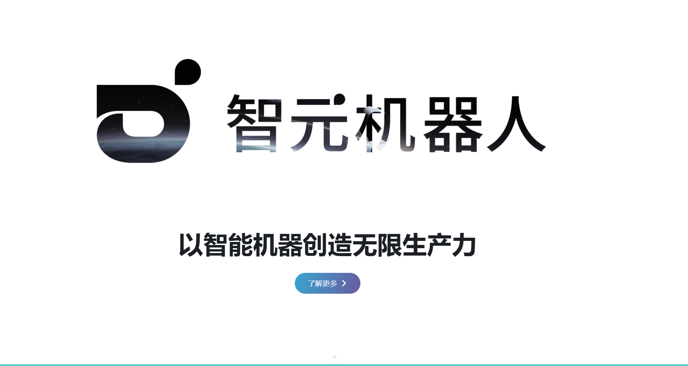








# Welcome! 
I am currently a master's student at [The University of ShangHaiTech](https://www.shanghaitech.edu.cn/). Fortunately to be supervised  by [Prof. Xuming He](https://faculty.sist.shanghaitech.edu.cn/faculty/hexm/index.html) in the Plus Lab, part of The Visual & Data Intelligence (VDI) Center.

Since September 2024, I have been working as an intern at [Tencent - Robotics X](https://roboticsx.tencent.com/) as a daily intern in Shenzhen, focusing on robotic grasping based on human priors. At [AGI-bot](https://www.agibot.com/), I work on world models and video generation models. I believe that a model that understands physical constraints and world rules is an important cornerstone on the road to AGI.

My research interests include Deep Learning, Generative Models, and Embodied AI.

You can find my CV here: [wuxiaofei](../assets/resume.pdf). If you are interested in my work, please feel free to drop me an [email](wuxiaofei01@qq.com).

<!--插入图片语法为：-->

# 🔥 News
- *2024.11*: &nbsp;one Paper accepted by the International Conference on 3D Vision (3DV-2025)
- *2024.01*: &nbsp;one paper accepted by International Joint Conference on Artificial Intelligence (IJCAI-2024)

# 📝 Publications 

[Pack and Force Your Memory: Long-form and Consistent Video Generation](https://arxiv.org/abs/2510.01784)

**xiaofei wu**, Guozhen Zhang, Zhiyong Xu, Yuan Zhou, Qinglin Lu, Xuming He

[**Project**](https://wuxiaofei01.github.io/PFVG/)

<!-- 

3DV 2025

 -->

[AffordGrasp: Cross-Modal Diffusion forAffordance-Aware Grasp Synthesis]()

**xiaofei wu**, Yi Zhang, Yumeng Liu, Yuexin Ma, Yujiao Shi, Xuming He

3DV 2025

[FastGrasp: Efficient Grasp Synthesis with Diffusion](https://arxiv.org/abs/2411.14786)

**xiaofei wu**, Tao Liu, caoji li, Yuexin Ma, Yujiao Shi, Xuming He

[**Project**](https://github.com/wuxiaofei01/FastGrasp)

IJCAI 2024

[Realdex: Towards human-like grasping for robotic dexterous hand](https://arxiv.org/abs/2402.13853)

Yumeng Liu, Yaxun Yang, Youzhuo Wang , Xiaofei Wu , Jiamin Wang , Yichen Yao , Sören Schwertfeger, Sibei Yang, Wenping Wang, Jingyi Yu, Xuming He, Yuexin Ma,

[**Project**](https://4dvlab.github.io/RealDex_page/)

# 🎖 Honors and Awards
- *2024.12* Outstanding students of ShanghaiTech University (Top 10%)
- *2022.08* Robocom Robot Developer Competition, Silver Medal
- *2021-06* Bronze Medal in National College Student Group Programming Competition
- *2020.10* Gold Award in Liaoning Provincial Programming Competition (Top 5%)
- *2020.9* Northeastern University First Class Scholarship (top 10%)
- *2020.3* Outstanding students of Northeastern University (Top 10%)

# 📖 Educations
- *2023.09 - 2026.07*, Master of The Visual & Data Intelligence (VDI) Center, ShangHaiTech University, ShangHai, China
  - Supervised by [Prof. Xuming He](https://faculty.sist.shanghaitech.edu.cn/faculty/hexm/index.html)
- *2019.09 - 2023.07*, Bachelor of Computer Science and Technology Major, Northeastern University, shenyang, China

# 💻 Internships

    

        

            

                
Tencent

                
            

        

        

            <a href="[https://roboticsx.tencent.com](https://hunyuan.tencent.com/)/" style="text-decoration: none; color: #007bff;">Tencent - HunYuan</a>
            
<strong>Department · HY · Video Generation</strong>

            <ul>
                <li>Advised by Mr. Yuan Zhou</li>
                <li>Sep. 2025.3 - 2025.10</li>
            </ul>
        

    

    

    

        

            

                
Agi-Bot

                
            

        

        

            <a href="https://www.zhiyuan-robot.com/" style="text-decoration: none; color: #007bff;">AGI-Bot</a>
            
<strong>Department · World Model/ Video Generation</strong>

            <ul>
                <li>Advised by Mr. Liliang Chen</li>
                <li>Sep. 2024.12 - 2025.3</li>
            </ul>
        

    

    

        

            

                
Tencent

                
            

        

        

            <a href="https://roboticsx.tencent.com/" style="text-decoration: none; color: #007bff;">Tencent - Robotics X</a>
            
<strong>Department · Embodied AI Department · Perception and Action Collaboration Group</strong>

            <ul>
                <li>Advised by Mr. Yu Zheng</li>
                <li>Sep. 2024.8 - 2024.12</li>
            </ul>
        

    

